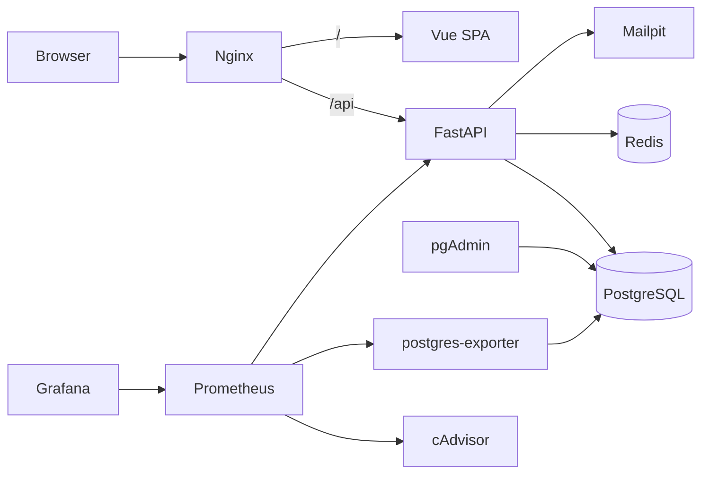

# RoleGate

**Authentication & role-based access control (RBAC) admin platform.**

RoleGate is a full-stack starter for apps that need secure sign-up, sign-in and fine-grained permissions. Users register, verify their email and land on a professional admin dashboard (sidebar, header, footer, content area) where menus and actions adapt to their permissions. It is built with **FastAPI**, **Vue 3** and **Bootstrap 5**, and ships as a single `docker compose` stack with Nginx, PostgreSQL, Redis and a Prometheus + Grafana monitoring setup.

---

## Features

**Authentication**
- Registration with email verification
- Login with short-lived JWT access tokens (15 min) and rotating refresh tokens in httpOnly cookies, with reuse detection
- Forgot / reset password by email
- Change password from the profile page (other devices are signed out)
- Redis rate limiting on sensitive endpoints, plus per-account lockout after repeated failed logins

**Authorization (RBAC)**
- Users, roles and permissions (`resource:action`, e.g. `users:read`)
- Default roles: `admin`, `manager`, `user`
- Create custom roles and assign permissions from the UI
- Permissions enforced in the API (`require_permission`) and reflected in the UI (menus, buttons, route guards)

**Admin dashboard**
- Responsive Bootstrap 5 layout with collapsible sidebar, header user menu and footer
- Dashboard, Users (list, create, assign roles, enable/disable), Roles & Permissions, Profile

**Infrastructure & operations**
- Docker Compose for the whole stack, Nginx reverse proxy
- PostgreSQL with pgAdmin, Alembic migrations
- Prometheus, Grafana, postgres-exporter and cAdvisor for monitoring
- Mailpit to catch emails in development

---

## Tech stack

| Layer | Technology |
|---|---|
| Backend | FastAPI, SQLAlchemy 2, Alembic, Pydantic v2, PyJWT, bcrypt |
| Frontend | Vue 3, Vite, Pinia, Vue Router, Axios, Bootstrap 5, Bootstrap Icons |
| Data | PostgreSQL 16, Redis 7 |
| Proxy | Nginx |
| Monitoring | Prometheus, Grafana, postgres-exporter, cAdvisor |
| Dev tools | Docker Compose, pgAdmin, Mailpit |

## Architecture



## Quick start

**Requirements:** Docker and Docker Compose v2.

```bash
git clone https://github.com/<your-username>/rolegate.git
cd rolegate

cp .env.example .env        # then edit .env and change every password / secret
docker compose up -d --build
```

Database migrations are applied automatically when the backend starts, and the default roles, permissions and first admin account are seeded.

| Service | URL | Notes |
|---|---|---|
| App | http://localhost | Sign in with `FIRST_ADMIN_EMAIL` / `FIRST_ADMIN_PASSWORD` from `.env` |
| API docs (Swagger) | http://localhost/api/docs | |
| Mailpit (caught emails) | http://localhost:8025 | Verification and reset links appear here |
| pgAdmin | http://localhost:5050 | Server host `db`, port `5432` |
| Grafana | http://localhost:3000 | Prometheus data source is pre-provisioned |
| Prometheus | http://localhost:9090 | |

In Grafana, go to *Dashboards → Import* and use ID `9628` (PostgreSQL) and `14282` (cAdvisor containers). API request metrics (`http_requests_total`, latency histograms) are scraped from the backend's `/metrics` endpoint.

## Configuration

All settings live in `.env` (see `.env.example`).

| Variable | Description |
|---|---|
| `POSTGRES_USER`, `POSTGRES_PASSWORD`, `POSTGRES_DB` | Database credentials |
| `DATABASE_URL` | SQLAlchemy URL used by the backend |
| `SECRET_KEY` | JWT signing key: use a long random value |
| `ACCESS_TOKEN_EXPIRE_MINUTES` | Access token lifetime (default 15) |
| `REFRESH_TOKEN_EXPIRE_DAYS` | Refresh token lifetime (default 7) |
| `RESET_TOKEN_EXPIRE_MINUTES` | Password reset link lifetime (default 30) |
| `VERIFY_TOKEN_EXPIRE_HOURS` | Email verification link lifetime (default 24) |
| `COOKIE_SECURE` | Set `true` when served over HTTPS |
| `FRONTEND_URL` | Base URL used in email links |
| `SMTP_HOST`, `SMTP_PORT`, `SMTP_USER`, `SMTP_PASSWORD`, `SMTP_FROM` | Outgoing email (Mailpit by default) |
| `REDIS_URL` | Redis connection for rate limiting |
| `LOGIN_MAX_FAILURES`, `LOGIN_LOCK_SECONDS` | Account lockout policy |
| `FIRST_ADMIN_EMAIL`, `FIRST_ADMIN_PASSWORD` | Seeded administrator account |
| `PGADMIN_EMAIL`, `PGADMIN_PASSWORD` | pgAdmin login |
| `GRAFANA_USER`, `GRAFANA_PASSWORD` | Grafana login |

## Roles and permissions

| Permission | Allows |
|---|---|
| `dashboard:view` | Open the dashboard |
| `users:read` | List users |
| `users:create` | Create users |
| `users:update` | Change user roles, enable/disable users |
| `roles:read` | List roles and permissions |
| `roles:create` / `roles:update` / `roles:delete` | Manage roles |

| Default role | Permissions |
|---|---|
| `admin` | All (kept in sync automatically) |
| `manager` | `dashboard:view`, `users:read`, `roles:read` |
| `user` | `dashboard:view` (assigned on registration) |

To add a permission, append it to `PERMISSIONS` in `backend/app/seed.py`, protect an endpoint with `Depends(require_permission("your:permission"))`, and (optionally) gate UI with `auth.can('your:permission')`.

## API overview

Interactive docs are at `/api/docs`.

| Area | Endpoints |
|---|---|
| Auth | `POST /api/auth/register`, `verify-email`, `resend-verification`, `login`, `refresh`, `logout`, `forgot-password`, `reset-password`, `change-password`; `GET /api/auth/me` |
| Users | `GET /api/users`, `POST /api/users`, `PUT /api/users/{id}/roles`, `PATCH /api/users/{id}/active` |
| Roles | `GET /api/roles`, `GET /api/roles/permissions`, `POST /api/roles`, `PUT /api/roles/{id}`, `DELETE /api/roles/{id}` |
| System | `GET /api/health` |

## Project structure

```
rolegate/
├── docker-compose.yml
├── .env.example
├── nginx/default.conf
├── monitoring/
│   ├── prometheus/prometheus.yml
│   └── grafana/provisioning/datasources/datasource.yml
├── backend/
│   ├── Dockerfile
│   ├── requirements.txt
│   ├── alembic.ini
│   ├── alembic/                 # migrations (env.py, versions/)
│   └── app/
│       ├── main.py              # app, lifespan, metrics
│       ├── config.py            # settings from environment
│       ├── database.py
│       ├── models.py            # User, Role, Permission, tokens
│       ├── schemas.py
│       ├── security.py          # password hashing, JWT, token hashing
│       ├── deps.py              # current user, require_permission
│       ├── ratelimit.py         # Redis rate limiting + lockout
│       ├── emailer.py
│       ├── seed.py              # default roles, permissions, admin
│       └── routers/             # auth.py, users.py, roles.py
└── frontend/
    ├── Dockerfile
    ├── nginx.conf
    ├── package.json
    ├── vite.config.js
    └── src/
        ├── main.js, App.vue, style.css
        ├── api/http.js          # Axios + silent token refresh
        ├── stores/auth.js       # Pinia auth store
        ├── router/index.js      # route guards
        ├── layouts/AdminLayout.vue
        ├── components/          # Sidebar, Header, Footer, UserCreateModal
        └── views/               # Login, Register, ForgotPassword, ResetPassword,
                                 # VerifyEmail, Dashboard, Users, Roles, Profile
```

## Development

**Frontend with hot reload**

```bash
cd frontend
npm install
npm run dev        # http://localhost:5173, proxies /api to localhost:8000
```

**Database migrations (Alembic)**

```bash
# after editing backend/app/models.py
docker compose run --rm backend alembic revision --autogenerate -m "describe change"
docker compose up -d --build backend     # applies `alembic upgrade head` on startup

docker compose run --rm backend alembic current      # show applied revision
docker compose run --rm backend alembic downgrade -1 # roll back one step
```

Always review generated migrations before committing them.

**Logs**

```bash
docker compose logs -f backend
```

## Security notes

- Passwords are hashed with bcrypt; refresh and reset tokens are stored only as SHA-256 hashes.
- Refresh tokens live in httpOnly, `SameSite=Lax` cookies scoped to `/api/auth`, rotate on every use, and reuse of an old token revokes all of that user's sessions.
- Rate limiting reads the client IP from the `X-Real-IP` header set by Nginx, so keep Nginx as the only public entry point.

### Before going to production

- [ ] Replace every password and `SECRET_KEY` in `.env`
- [ ] Serve over HTTPS and set `COOKIE_SECURE=true`
- [ ] Remove the `8000:8000` port mapping from the `backend` service
- [ ] Do not expose pgAdmin, Prometheus, Grafana or Mailpit publicly (or protect them)
- [ ] Remove the `alembic/versions` bind mount from the `backend` service
- [ ] Configure a real SMTP provider and remove `mailpit`
- [ ] Set up database backups

## Roadmap

- [ ] Audit log (who changed which user or role)
- [ ] Centralized logging with Loki + Promtail
- [ ] Automated tests and CI pipeline
- [ ] Two-factor authentication

## License

MIT. Add a `LICENSE` file before publishing.
